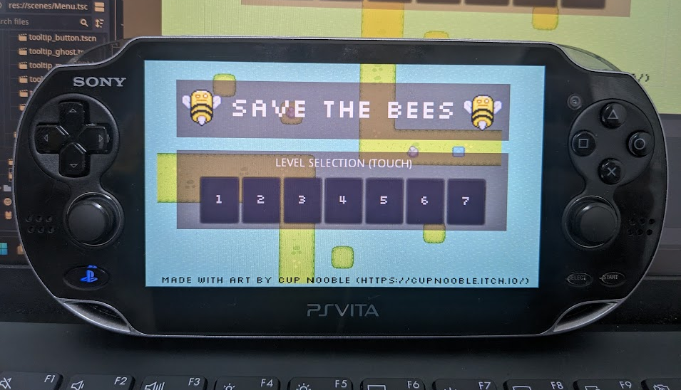
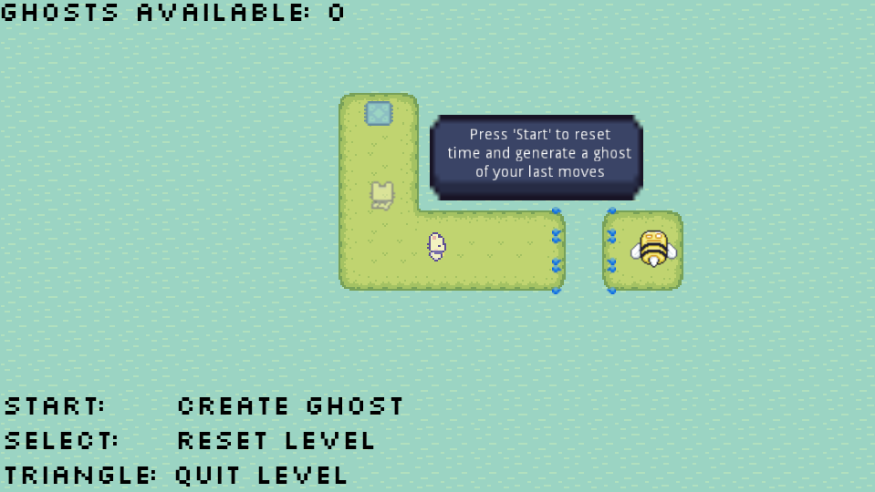
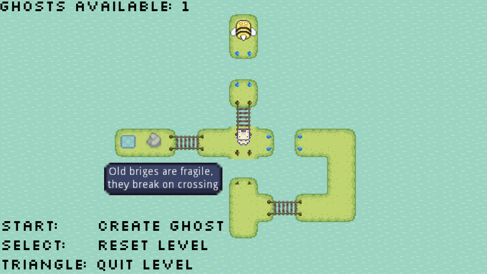

# Save The Bees

`Save The Bees` is a small puzzle game that I created mostly to serve as a project to learn the Godot Engine. As such probably nothing in this project is done well and should not be used as a reference for how to build a game in Godot.

The game only has 7 small levels as it was a learning project. I used to opportunity to play around with the idea of solving puzzles by creating ghosts of onself to complete parts of the puzzle "in the past". Concept generally seems to work pretty well. Might or might not expand this into a more full game.

## Assets

The cute assets are by [CupNooble](https://cupnooble.itch.io/)

## PSP Vita Stuff

Ok so I am in Japan for a bit and got a PSP-Vita on a whim. The Vita is soo cool, wish I got one years ago.

Then I found out someone has made a [godot 3.5 port for the vita](https://github.com/SonicMastr/godot-vita) which is what I made this game in... So figgured I might see if I can get it to run.

It works quite well.

VPK can be downloaded from GitHub Releases.

## Web Version

A web version is playable [here](https://nkew4630blog.z8.web.core.windows.net/savebees/savethebees.html)
